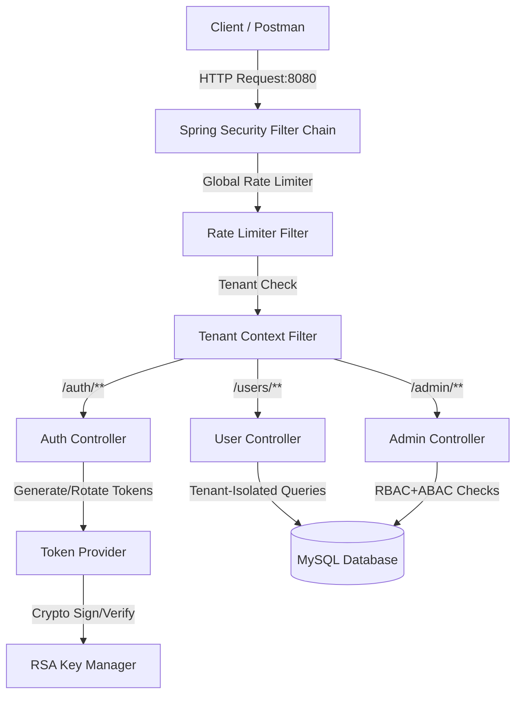

# Enterprise OAuth2 & JWT Security Monolith

This is a production-grade authentication and authorization security system built as a **single, unified Spring Boot application** running on port `8080`. It supports multi-tenant database isolation, stateless JWT validation using local RSA public keys, brute force protection (rate limiting), session blacklist revocation, and role-based access control (RBAC).

---

## 🏛️ System Architecture

Instead of multiple microservices, all services run within a single JVM process on port `8080`, reducing RAM consumption, preventing port conflicts, and making Eclipse development extremely simple.



### Key Components:
1.  **Filters**:
    *   `RateLimiterFilter`: Performs sliding-window client IP rate limiting (limits request abuse).
    *   `TenantFilter`: Asserts that `X-Tenant-ID` header matches the validated tenant claim in the incoming JWT, and sets the ThreadLocal `TenantContext` for query isolation.
2.  **Core Security**:
    *   `RsaKeyManager`: Persists RSA keypair parameters to `keystore.json` so signatures survive application hot-reloads.
    *   `TokenProvider`: Generates signed JWTs with custom claims (`tenant_id`, `roles`, and `permissions`).
    *   `SecurityConfig`: Standardizes local verification of JWTs, mapping custom roles and permission claims directly to Spring Security GrantedAuthority.
3.  **Controllers**:
    *   `AuthController`: Exposes authentication paths `/auth/login`, `/auth/refresh`, `/auth/logout`, and `/oauth2/jwks`.
    *   `UserController`: Secured User CRUD. Uses `TenantContext` to ensure tenant isolation.
    *   `AdminController`: Secured admin metrics dashboard (`ROLE_ADMIN` + `ADMIN_ACCESS` authority required).

---

## 🗄️ Database Design

The database contains tables designed to manage multi-tenant user accounts and track token/security audit events:

*   **`tenants`**: Catalog of active tenants (e.g. `tenant-a`, `tenant-b`).
*   **`users`**: Tenant-isolated user accounts (`tenant_id`, `username`, `password`, `email`, `is_active`). Unique constraint on `(username, tenant_id)`.
*   **`roles`**: Tenant-isolated roles. Unique constraint on `(role_name, tenant_id)`.
*   **`permissions`**: Global permissions registry (e.g. `READ_USER`, `WRITE_USER`, `ADMIN_ACCESS`).
*   **`user_roles`** & **`role_permissions`**: Many-to-many relationship join tables.
*   **`refresh_tokens`**: Stores rotation tokens with expiry and revocation status.
*   **`audit_logs`**: Tracks login successes, failures, blocks, and token reuse violations.

---

## 🚀 Getting Started

### 1. Prerequisites
- **Java**: JDK 17 or later (compatible with Java 25).
- **Maven**: 3.8+
- **MySQL**: 8.0+ running locally on port `3306`.
- **Redis (Optional)**: If you have Redis running on port `6379`, you can enable it in `src/main/resources/application.yml` by setting `app.redis.enabled: true`. Otherwise, the system automatically falls back to secure, thread-safe, self-evicting in-memory caches.

### 2. Database Initialization
Run the initialization DDL script against your local MySQL server. Open a terminal/command prompt and run:
```bash
mysql -u root -p1254 < schema.sql
```
*Note: This creates the database `oauth2_security_db`, configures the schema, and seeds default tenants (`tenant-a`, `tenant-b`), roles, permissions, and initial users with encrypted passwords (`password123`).*

### 3. Import and Run in Eclipse
1.  Open Eclipse IDE.
2.  Select **File -> Import -> Existing Maven Projects**.
3.  Choose the root folder: `c:\Users\vikra.VIGNESHXBS-HP\eclipse-workspace\oauth2-security-system`.
4.  Once imported, right-click on the project in Package Explorer and select **Run As -> Spring Boot App** (or run `SecuritySystemApplication.java`).

---

## 📡 API Endpoints Reference

All requests run on port `8080`.

| Method | Endpoint | Description | Headers | Auth Required |
|---|---|---|---|---|
| **POST** | `/auth/login` | Authenticate and obtain JWT & Refresh token | `Content-Type: application/json` | No |
| **POST** | `/auth/refresh` | Exchange refresh token for new JWT | `Content-Type: application/json` | No |
| **POST** | `/auth/logout` | Log out and blacklist active JWT | `Authorization: Bearer <JWT>` | Yes |
| **GET** | `/oauth2/jwks` | Retrieve public key set (JWKS) | None | No |
| **GET** | `/users` | List users for authenticated tenant | `Authorization: Bearer <JWT>`, `X-Tenant-ID: <tenant>` | Yes (`READ_USER`) |
| **POST** | `/users` | Create user in tenant | `Authorization: Bearer <JWT>`, `X-Tenant-ID: <tenant>` | Yes (`WRITE_USER`) |
| **GET** | `/admin/stats` | View admin statistics | `Authorization: Bearer <JWT>`, `X-Tenant-ID: <tenant>` | Yes (`ROLE_ADMIN` + `ADMIN_ACCESS`) |

### Example Login Request
`POST http://localhost:8080/auth/login`
```json
{
    "username": "admin_a",
    "password": "password123",
    "tenantId": "tenant-a"
}
```

---

## 🧪 Verification via Postman
A pre-configured Postman Collection is available in the root folder: **[`POSTMAN_COLLECTION.json`](POSTMAN_COLLECTION.json)**.
1. Import the collection into Postman.
2. Run the **Login - Admin Tenant A** request to authenticate. The collection runs test scripts to automatically save the returned `accessToken` and `refreshToken` variables.
3. Test subsequent requests (such as **List Users** or **Get Admin Stats**).
